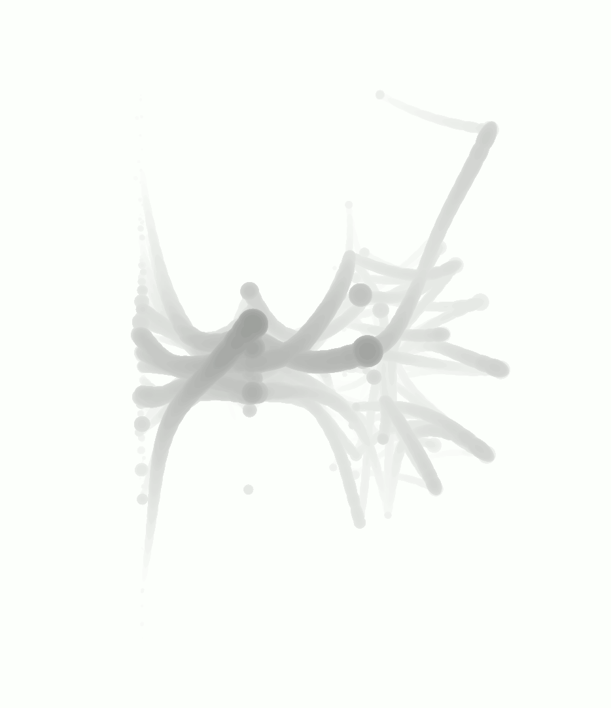
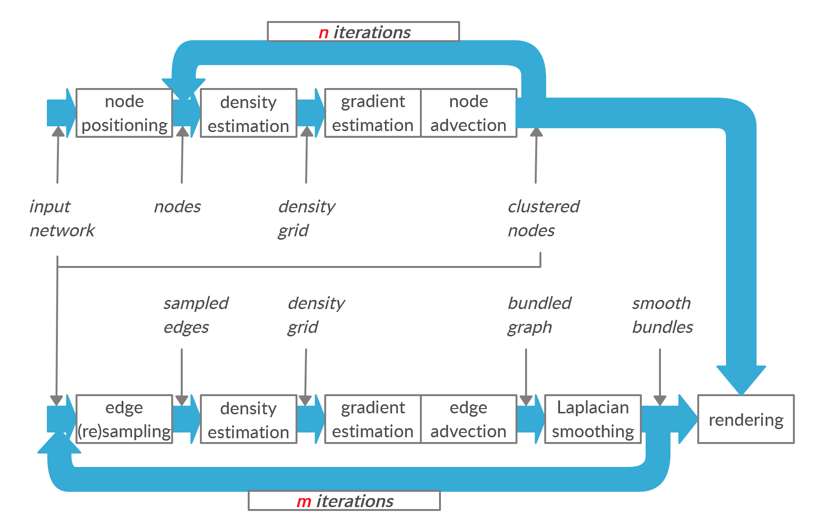
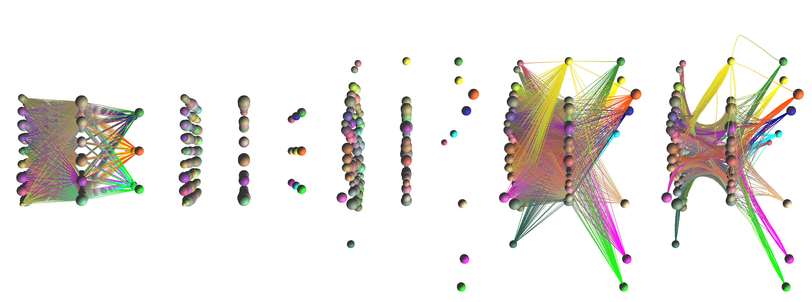
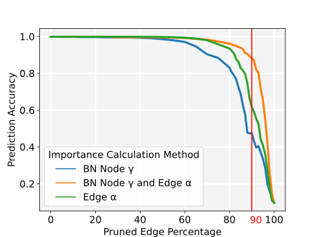
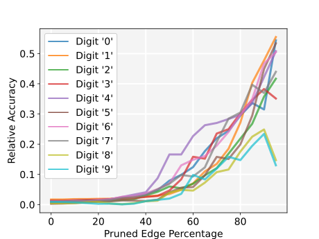
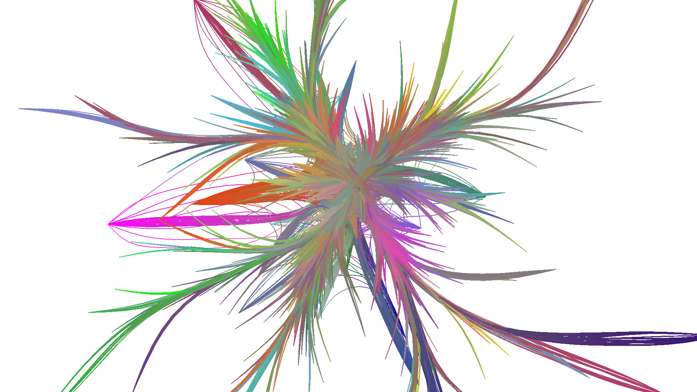
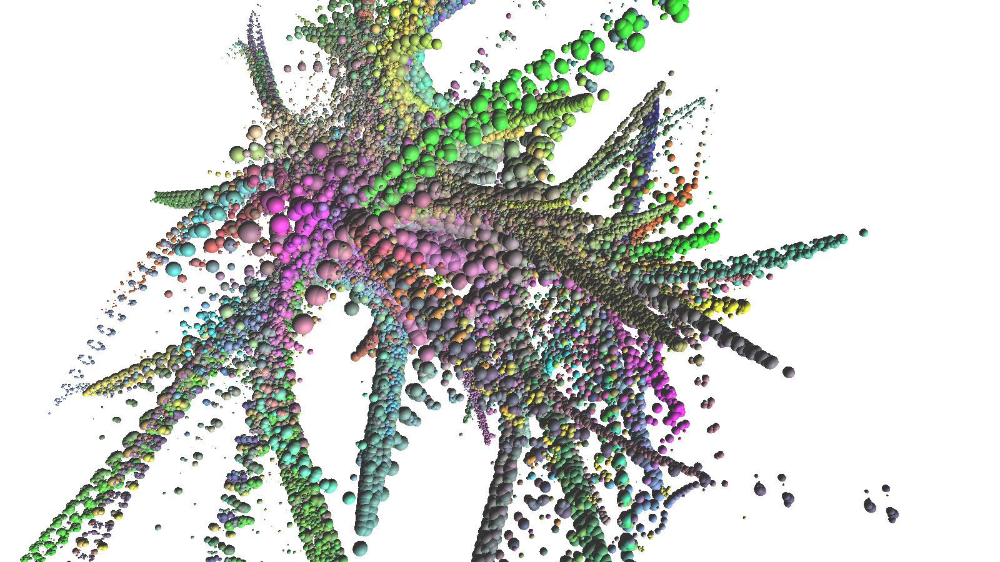
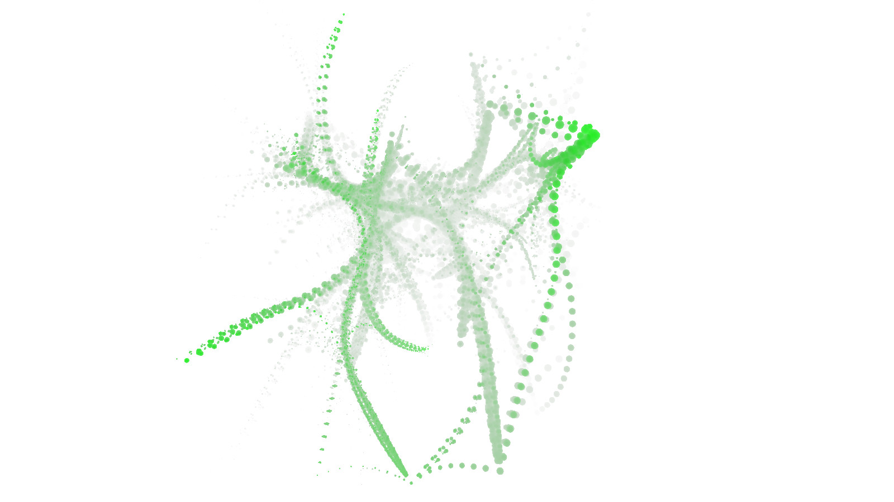

<h1 align="center">Neural Network Visualization</h2>
<p align="center">

</p>
<p align="center">
Visualization of neural network architectures and parameters.
</p>

## Description
This project was done for my master thesis. A general description can be taken from the abstract:

### Abstract
Artificial neural networks is a popular field of research in artificial intelligence. The increasing size and complexity of huge models entail certain problems. The lack of transparency of the inner workings of a neural network makes it difficult to choose efficient architectures for different tasks. It proves to be challenging to solve these problems, and with a lack of insightful representations of neural networks, this state of affairs becomes entrenched. With these difficulties in mind a novel 3D visualization technique is introduced. Attributes for trained neural networks are estimated by utilizing established methods from the area of neural network optimization. Batch normalization is used with fine-tuning and feature extraction to estimate the importance of different parts of the neural network. A combination of the importance values with various methods like edge bundling, ray tracing, 3D impostor and a special transparency technique results in a 3D model representing a neural network. The validity of the extracted importance estimations is demonstrated and the potential of the developed visualization is explored.

## How to use

1. Prepare the `configs/processing.json` with the parameters described [here](#parameters).
2. Create a neural network model and process it. An example of this process is given in `examples/process_mnist_model.py` on [MNIST](http://yann.lecun.com/exdb/mnist/) data.
3. Start the visualization tool `start_tool.py` and select the neural network via `Load Processed Network` to render the representation of the neural network.

Multiple scripts are located in `examples`, which can be adapted to create and process neural networks. `examples/evaluation_plots.py` for example can be used to recreate the evaluation data and plots of my thesis.

## Rendering Tool
The visualization tool `start_tool.py` can be used to render and/or process neural networks. Instead of existing ones, you can also generate random networks and process them of various sizes. For neural networks the visualization results in a more structured view of a neural network in regards to their trained parameters compared to the most common ones.

### Example

The parameters of the three neural networks represented above are all trained differently, while having the same architecture. The one on the left is not trained at all with randomly assigned values. The nodes and edges of this model spread further from the center. The middle one is trained with some basic settings for learning rate and achieving >90% accuracy. The third one on the right is trained in the same way but with an additional *L1* regularization, with similar accuracy rating and is the most narrow model. **The closer together the edges are the greater the generalization** of these parts of the neural network.

### Controls
|Key|Description|
|---|---|
|H|Toggle rotation|
|K|Screenshot|
|0-9|Switch camera position|

### GUI
The settings for shaders, statistics and the processing of neural networks in general is controllable by the gui.


### Shader Parameters
The parameters used in the shaders rendering the neural network can be changed by either the `configs/rendering.json` or by changing the values in the gui. The visualization can differ vastly and different results can be seen [here](#other-visualizations).

|Name|Recommended|Range|Description|
|---|---|---|---|
|Size|0.02|0 - 1.0|size of the primitive objects|
|Base Opacity|0.0|0.0 - 1.0|base opacity of the objects|
|Importance Opacity|1.1|0.0 - 2.0|rate at which the importance values influence opacity|
|Depth Opacity|0.5|0.0 - 1.0|rate at which the distance to the camera influence opacity|
|Depth Exponent|0.25|0.0 - 10.0|rate at which the density at different points on a object influences opacity|
|Importance Threshold|0.1|0.0 - 1.0|defines the threshold at which an object is rendered based on its importance value|


## Processing

The above pipeline explains the bundling process of a neural network through my code. 



This image shows the different stages in the processing pipeline.

### Parameters
The processing can be influenced by the following parameters. The default values are in general derived from empircally tested values of related work regarding edge bundling methods. Some values have a high impact on the processing time.

|Name|Recommended|Range|Description|Performance Impact|
|---|---|---|---|---|
|edge_bandwidth_reduction|0.9|0 - 1.0|reduction of advection range every iteration for edge samples|high|
|node_bandwidth_reduction|0.95|0 - 1.0|reduction of advection range every iteration for nodes|low|
|edge_importance_type|0|{0,1,2,3}|the calculation type for edge importance|low|
|layer_distance|0.5|0.0 - 1.0|the distance between the nodes of every neural network layer|medium|
|layer_width|1.0|0.0 - 1.0|the width of every layer slice on which the nodes reside|medium|
|prune_percentage|0.0|0.0 - 1.0|the percentage of edges, which should be ignored in order of their importance values, lower value means more longer processing|high|
|sampling_rate|15.0|5.0 - 20.0|defines the amount of samples created per distance unit, higher rate means more detailed|very high|
|smoothing|true|{true, false}|should smoothing of edges be applied between each iteration?, can break without|high|
|smoothing_iterations|8|0 - 16|smoothing iterations between every advection iteration|high|

To change the parameters for processing change values in following file:
**configs/processing.json**
```json
{
    "edge_bandwidth_reduction": 0.9,
    "edge_importance_type": 0,
    "layer_distance": 0.5,
    "layer_width": 1.0,
    "node_bandwidth_reduction": 0.95,
    "prune_percentage": 0.0,
    "sampling_rate": 15.0,
    "smoothing": true,
    "smoothing_iterations": 8
}
```

### Importance
Each classification is represented by one color. Nodes and egdes are colored according to their importance in the network for correctly predicting the associated class. The validity of the importance is proven by pruning the model parameters in order of their calculated importance.

Overall Importance Pruning             |  Class Importance Pruning
:-------------------------:|:-------------------------:
  |  

The left plot shows that pruning unimportant parameters does not influence the prediction accuracy of the model as much as the important parameters.

Also by pruning based on importance of specific classes shows the accuracy is preserved for the exact classes in the right plot. The accuracy for the focused class is always higher compared to the overall accuracy.

## Used System

* Windows 10
* NVIDIA GeForce GTX 1660 SUPER
* AMD Ryzen 7 3700X

### Notes
* **Processing Times** - Pocessing of a fully connected neural network with following nodes per layer: 784, 81, 49, 10 takes 12 minutes. So the one-time calculations are not in real-time.

## Other Visualizations



